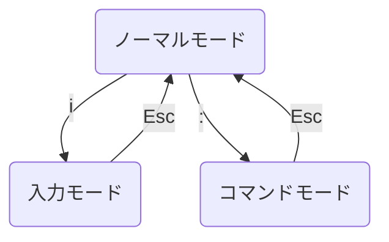

この記事は、[新人プログラマ応援 - みんなで新人を育てよう！ - Qiita](https://qiita.com/official-events/3f21c92121aa125807b4)の参加記事です。

https://qiita.com/official-events/3f21c92121aa125807b4

## はじめに

僕が新卒エンジニアとして入社したとき、Git で操作をするときに「Vim の操作わからん」となって困った記憶があります。
なので、とりあえずこれだけ覚えればなんとかなるよってことを書いておいて、新人プログラマの役に立てればと思います。

## Vim の操作

### モード

VS Code などのエディタと違い、Vim にはモードという概念があります。

（Vimmer に怒られそうですが、）各モードは

- ノーマルモード
  - カーソルを移動する
- 入力モード
  - テキストを入力、編集
- コマンドモード
  - 終了、保存などをする

です。
（ここでは書いていないですが、他にもモードがいくつかあります。）

Vim を開いたときのモードが **ノーマルモード** です。

ノーマルモードの状態で`i`を押すと入力モードへ、
ノーマルモードの状態で`:`を押すとコマンドモードへ、
ノーマルモードに戻りたいときは`Esc`を押すと戻ります。

また、現在のモードは左下に書いているので、わからなくなったら左下を見ましょう。

|      モード      |                                                       表示                                                       |
| :--------------: | :--------------------------------------------------------------------------------------------------------------: |
|  ノーマルモード  |  |
|    入力モード    |  |
|  コマンドモード  |  |

### カーソルの移動

ノーマルモードで`h` `j` `k` `l`のキーを使って操作します。
以下の図で覚えると簡単です。

### 終了、保存したい

コマンドモードで以下のコマンドを入力して Enter キーを押します。

| 操作             | コマンド |
| :--------------- | :------: |
| 終了する         |  **q**   |
| 強制終了する     |  **q!**  |
| 保存する         |  **w**   |
| 保存して終了する |  **wq**  |

保存して終了する例は以下。
`:`を押してコマンドモードに移って、`wq`を入力し、Enter キーを押す。

**`q`で終了できないときは、ファイルの編集をしてるが保存されていないときなどです。**
保存する場合は`w`、保存したくない場合は`q!`で終了させると良いです。

## さいごに

これで最小限の Vim の操作はできるはずです！
もし、Vim に興味があれば、調べてみるとより Vim を使いこなせるはずです！

蛇足ですが、僕が普段使っているエディタは VS Code なんですが、Vim のキーボードから手を離さなくてよいことに惹かれて VS Code で Vim の拡張機能を使ってます。

https://marketplace.visualstudio.com/items?itemName=vscodevim.vim

おすすめです。

## Refs

- [Vim - Visual Studio Marketplace](https://marketplace.visualstudio.com/items?itemName=vscodevim.vim)
- [マスタリング Vim：書籍案内｜技術評論社](https://gihyo.jp/book/2020/978-4-297-11169-4)
