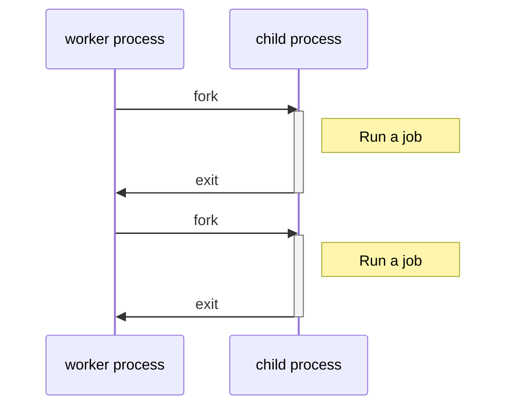

## これはなに

Resqueで処理中のジョブを中断したいなと思って調べたのですが、キューに積まれているジョブを削除する方法しか出てこなくて困ったので記事にします。

## 方法

Resqueの親プロセスに対して`USR1`シグナルを送ることで、ジョブを走らせている子プロセスを終了させることができます。

```
$ kill -s USR1 RESQUE_PID
```

## 詳細

### Resqueのプロセス

Resqueはジョブごとにプロセスをforkし、forkされた子プロセスでジョブが実行されます。

> Unlike Sidekiq (a well-designed & well-maintained alternative!) it forks a new process for each job, which makes it resilient to memory leaks and eliminates thread-safety concerns.

（https://resque.github.io/ より引用）

> Forking
> On certain platforms, when a Resque worker reserves a job it immediately forks a child process. The child processes the job then exits. When the child has exited successfully, the worker reserves another job and repeats the process.

（https://github.com/resque/resque#forking より引用）



実際のプロセスは以下のようになっています。

```
$ ps -e -o pid,ppid,command | grep resque
92099     1 resque: Forked 92102 at 1253142769
92102 92099 resque: Processing file_serve since 1253142769
```

（https://github.com/resque/resque#parents-and-children より参照）

`resque: Forked 92102 at 1253142769`が親プロセスで、`resque: Processing file_serve since 1253142769`が子プロセスです。

なお、ジョブが走っていない場合は、以下のように表示されます。

```
$ ps -e -o pid,ppid,command | grep resque
92099 1 resque: Waiting for file_serve,warm_cache
```

### `USR1`シグナル

ResqueのREADMEにある`USR1`シグナルの説明を見ると、

> - `USR1` - Immediately kill child but don't exit
>
> If you want to kill a stale or stuck child, use `USR1`. Processing will continue as normal unless the child was not found. In that case Resque assumes the parent process is in a bad state and shuts down.

（https://github.com/resque/resque#signals より引用）

シグナルを受け取ると子プロセスを終了させ、親プロセスは存続する様です。
なので、終了させたいジョブが動いているプロセスの親プロセスに対して`USR1`シグナルを送ることで強制的にジョブを終了させることができます。

```
$ kill -s USR1 92099
```

> In that case Resque assumes the parent process is in a bad state and shuts down.

また、この部分が気になったのでソースを軽く読んでみましたが、`USR1`シグナルを受け取ったタイミングで親プロセスを終了させるような処理を見つけられませんでした。（知っている方がいれば教えていただけると助かります :pray:）

## Refs

- [Forking - resque/resque](https://github.com/resque/resque#forking)
- [Signals - resque/resque](https://github.com/resque/resque#signals)
- [resque.github.io](https://resque.github.io/)
