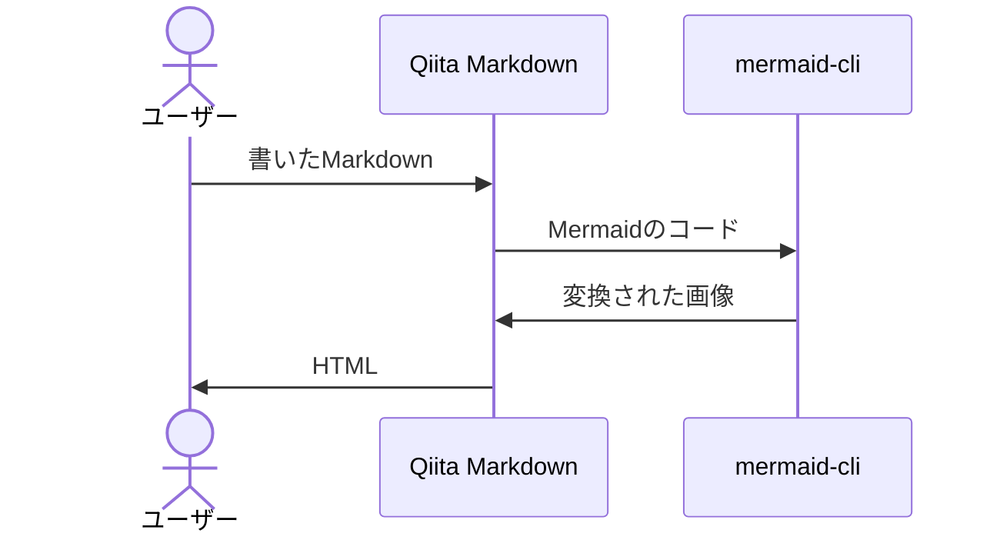
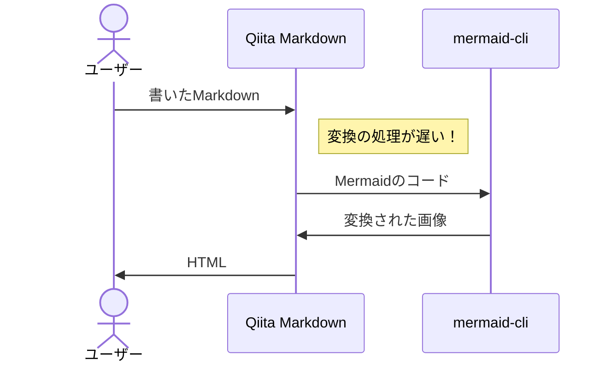
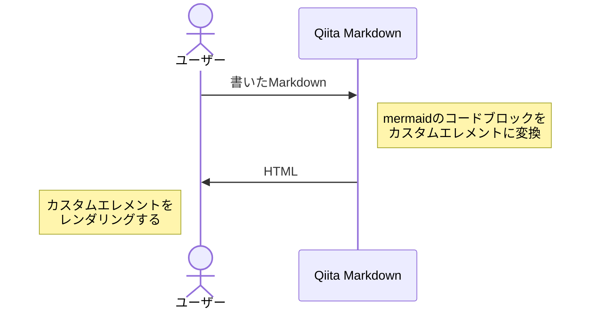
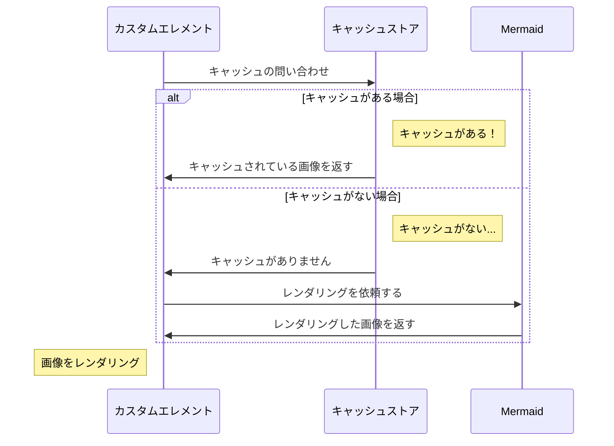

先日、Qiita で[**Mermaid でのダイアグラム表示がベータ版として公開されました！**](https://qiita.com/release-notes#2022-03-28)

[](https://qiita.com/release-notes#2022-03-28)

僕は Mermaid でダイアグラムを書いたことがなく、せっかくなので「Qiita で Mermaid 対応した話」を**Mermaid を使って**記事にします。

## Mermaid とは

Mermaid とはダイアグラム（図）を書くためのツールで、コードを書くことでグラフを書くことができます。
詳しくは[公式ドキュメント](https://mermaid-js.github.io/mermaid/#/)をご覧ください。

Qiita では以下のようにすることで書くことができます。

:::note warn
ベータ版を有効にする必要があります
:::

    ```mermaid
    graph TD;
        A-->B;
        A-->C;
        B-->D;
        C-->D;
    ```

上記のコードブロックが以下のようなグラフになります。


## どうやって実現しているのか？

結論から話すと、Qiita では Web Component を使って実現しています。

ですが、はじめは [mermaid-cli](https://github.com/mermaidjs/mermaid.cli) をベースに Qiita の Markdown パースの仕組みに組み込もうとしていました。

### 当初の予定

ざっくりとしたイメージは以下です。



理由としては、

- 記事・質問ページの CLS 悪化
- エディタ上でのプレビューのちらつき

によるユーザー体験の悪化をなくしたかったためです。

しかし、`mermaid-cli`での処理時間が長く、最適化を行っても 300ms 程度かかってしまっていました。
（`mermaid-cli`の内部としては、ブラウザを立ち上げて実際にレンダリングさせ、レンダリングされた画像を返している実装になっています）
`mermaid-cli`が遅いと、その分プレビューなどのレスポンスタイムにも影響が出てしまうため、断念しました。



### クライアントでやるしかない

`mermaid-cli`の件で、サーバー側で Mermaid を処理することは難しいため、ユーザーのブラウザ側で Mermaid を処理することにしました。

クライアントでやるといっても方法はいくつか考えられます。結論としては Web Component を使った実装にしました。



理由は、

- サーバー側では Mermaid のコードブロックをカスタムエレメントとして変換するだけで良い
- クライアントの実装がカスタムエレメントで完結する

ためです。

### プレビューのちらつきがつらい...

クライアントで Mermaid をレンダリングするにあたり、Qiita のエディタのように要素の入れ替わりが激しい場合、毎回レンダリングを行うため、どうしてもプレビュー画面の Mermaid ダイアグラムがちらつき、ガクガクしてしまいます。

当初、サーバーで処理をしたかった理由の、

- 記事・質問ページの CLS 悪化
- エディタ上でのプレビューのちらつき

を少しでも軽減するために、Qiita では Mermaid のレンダリングに少し工夫をして、**Mermaid のコードが書き変わったときのみ**Mermaid をレンダリングするようにしています。

イメージは以下のような感じです。



これによって、エディタで Mermaid のコードブロック以外を書いている際にプレビューでの Mermaid ダイアグラムのちらつきをなくしています。

## さいごに

Mermaid を使って「Qiita で Mermaid 対応した話」を書いてみました。
ぜひ、Mermaid を使って記事を書いてみていただけると嬉しいです！

もし不具合などありましたら、

https://github.com/increments/qiita-discussions/discussions

よりご報告していただけると幸いです。
