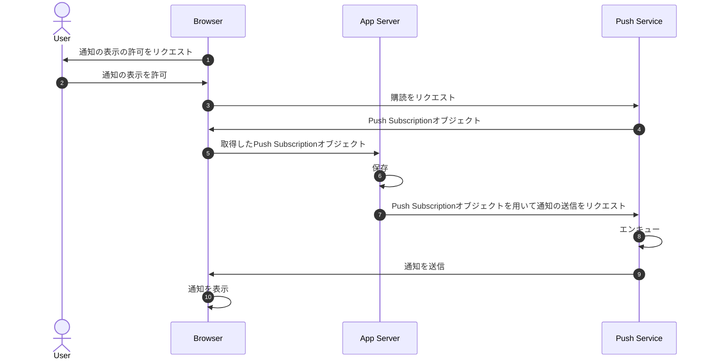

## はじめに

iOS SafariでのPush通知のサポート予定とのことなので、この機会にWebでのPush通知について調べました。
WebでのPush通知を学ぶにあたって、WebでのPush通知の仕組み・全体像を知っておくと良いなと感じたので記事にします。

## 全体像

Push通知の全体像としては以下。



## 通知購読をし、そのユーザーを保存する

図で言うところの1 ~ 6。

必要なことは以下。

1. 通知の許可を得る
1. [PushSubscription](https://developer.mozilla.org/ja/docs/Web/API/PushSubscription)オブジェクトを取得
1. 取得した[PushSubscription](https://developer.mozilla.org/ja/docs/Web/API/PushSubscription)オブジェクトを自身のデータベースへ保存

### 1. 通知の許可を得る

[Notification API](https://developer.mozilla.org/ja/docs/Web/API/Notifications_API)を用いて、ユーザーに通知の許可を要求する。

- [Notification.requestPermission() - Web API | MDN](https://developer.mozilla.org/ja/docs/Web/API/Notification/requestPermission)

### 2. [Push Subscription](https://developer.mozilla.org/ja/docs/Web/API/PushSubscription)オブジェクトを取得

[Push API - Web API | MDN](https://developer.mozilla.org/ja/docs/Web/API/Push_API)を用いてPush Serviceの購読をする。
PushSubscriptionオブジェクトには、以下のようなデータが含まれている。

```json:PushSubscriptionオブジェクトの例
{
  "endpoint": "https://fcm.googleapis.com/fcm/send/c1KrmpTuRm…",
  "expirationTime": null,
  "keys": {
    "p256dh": "BGyyVt9FFV…",
    "auth": "R9sidzkcdf…"
  }
}
```

- [PushManager.subscribe() - ウェブ API | MDN](https://developer.mozilla.org/ja/docs/Web/API/PushManager/subscribe)

### 3. 取得した[Push Subscription](https://developer.mozilla.org/ja/docs/Web/API/PushSubscription)オブジェクトを自身のデータベースへ保存

`2. Push Subscriptionオブジェクトを取得` で取得したデータは、Push Messageを送信する際に必要となるため、保持しておく。

## Push Messageを送信する

図で言うところの7 ~ 9。

保持している、Push Subscriptionオブジェクトをもとに、Push Serviceを経由してPush Messageをリクエストする。
Push Serviceが受け取ったPush Messageはキューに積まれ、対象のデバイスに対して送信する。

なお、Push Serviceへのリクエストには、暗号化、署名などが必要になる。
（https://github.com/web-push-libs/ でライブラリが用意されている）

## Push Messageを受け取り、通知として表示する

Push Messageを受け取ると、Service Workerの[pushイベント](https://developer.mozilla.org/ja/docs/Web/API/ServiceWorkerGlobalScope/push_event)が発火する。
[ServiceWorkerRegistration.showNotification()](https://developer.mozilla.org/ja/docs/Web/API/ServiceWorkerRegistration/showNotification) で受け取ったPush Messageを通知として表示させる。

また、通知を開いた場合は[notificationclickイベント](https://developer.mozilla.org/ja/docs/Web/API/ServiceWorkerGlobalScope/notificationclick_event)が発火する。

## さいごに

おおまかですが、全体像について書きました。
あくまでも全体像なので、要所要所の部分は抜けてますがお許しください。

WebでのPush通知を学ぶのに参考になれば幸いです。

## Refs

- [Push notifications overview - web.dev](https://web.dev/push-notifications-overview/)
